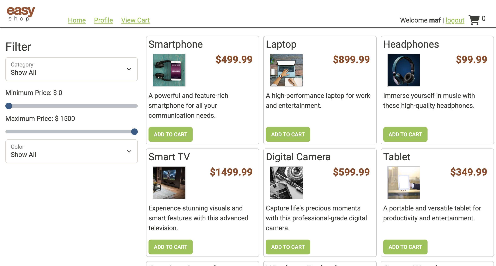
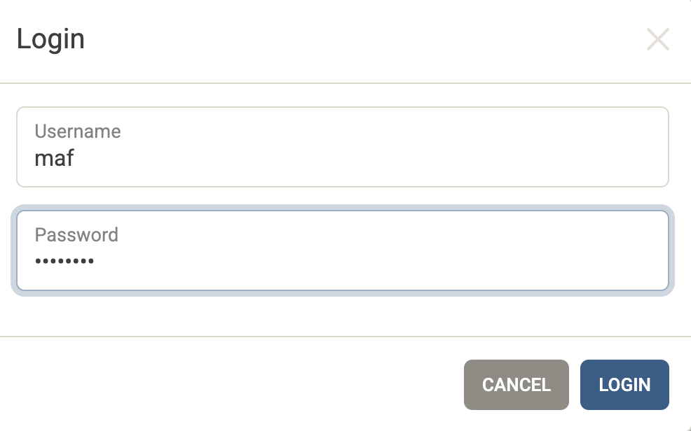
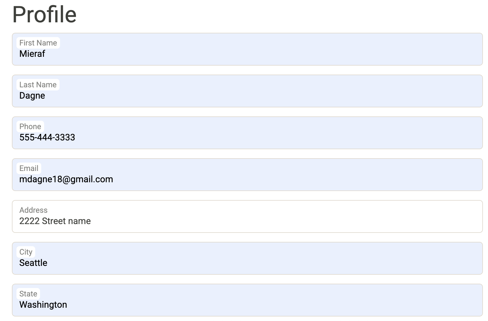
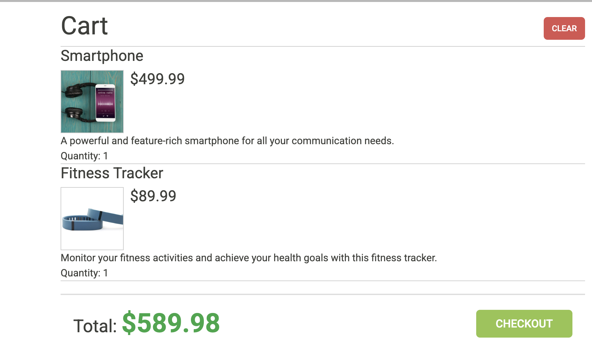
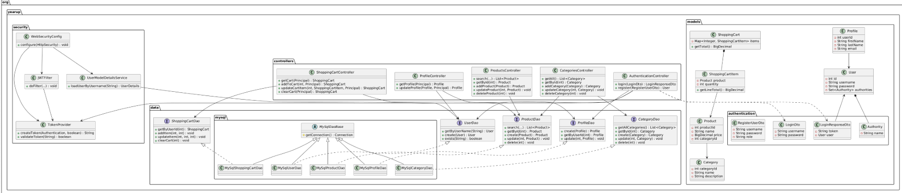

# EasyShop - E-Commerce Application

## 📖 Project Description

EasyShop is a modern, full-stack e-commerce application that demonstrates enterprise-level software development practices. Built with Spring Boot and featuring a clean RESTful API architecture, this application showcases secure authentication, role-based access control, and efficient data management patterns.

## ✨ Why This Project is Interesting

This project is particularly interesting because it demonstrates:

- **Real-World Architecture**: Implements a complete 3-tier architecture (Presentation, Business Logic, Data Access) following industry best practices
- **Security First**: Features JWT-based stateless authentication with role-based access control, showing how modern web applications handle security
- **Clean Code Principles**: Uses the DAO pattern for data access, separation of concerns, and dependency injection
- **Full-Stack Integration**: Combines a robust Spring Boot backend with a responsive frontend, demonstrating end-to-end development
- **RESTful Design**: Follows REST principles with proper HTTP methods, status codes, and JSON responses
- **Scalable Structure**: Designed with extensibility in mind, making it easy to add new features and maintain

## 🎯 Key Features

### 🔐 Authentication & Security
- **JWT Token Authentication**: Secure, stateless authentication using JSON Web Tokens
- **Role-Based Access Control**: Different permissions for ADMIN and USER roles
- **Password Encryption**: BCrypt hashing for secure password storage
- **Protected Endpoints**: Admin-only operations for product and category management

### 🛍️ E-Commerce Functionality
- **Product Catalog**: Browse and search products with advanced filtering (category, price range, subcategory)
- **Shopping Cart**: Add, update, and manage cart items with real-time total calculations
- **Category Management**: Full CRUD operations for organizing products (Admin only)
- **User Profiles**: Personal profile management with address and contact information

### 🏗️ Technical Features
- **RESTful API**: Clean, well-structured REST endpoints following HTTP standards
- **MySQL Database**: Relational database with proper schema design
- **Error Handling**: Comprehensive exception handling with appropriate HTTP status codes
- **CORS Support**: Cross-origin resource sharing enabled for frontend integration

## 📸 Screenshots

### Home Page
Browse products with filtering options and search functionality.



### Login Page
Secure JWT-based authentication interface.



### Profile Page
User profile management with personal information and address details.



### Shopping Cart
Interactive shopping cart with item management and total calculations.



### API Testing (Insomnia)
Example of creating a category using the REST API with Insomnia client.


### UML Architecture Diagram
Complete system architecture showing all classes, relationships, and design patterns.




## Project Structure

```
src/main/java/org/yearup/
├── controllers/          # REST Controllers
│   ├── AuthenticationController.java
│   ├── CategoriesController.java
│   ├── ProductsController.java
│   ├── ProfileController.java
│   └── ShoppingCartController.java
├── models/              # Domain Models
│   ├── Category.java
│   ├── Product.java
│   ├── Profile.java
│   ├── ShoppingCart.java
│   ├── ShoppingCartItem.java
│   ├── User.java
│   └── authentication/  # DTOs for authentication
├── data/                # Data Access Layer
│   ├── CategoryDao.java
│   ├── ProductDao.java
│   ├── ProfileDao.java
│   ├── ShoppingCartDao.java
│   ├── UserDao.java
│   └── mysql/          # MySQL Implementations
├── security/            # Security Configuration
│   ├── WebSecurityConfig.java
│   ├── UserModelDetailsService.java
│   └── jwt/            # JWT Components
└── configurations/      # Configuration Classes
    └── DatabaseConfig.java
```
## Technology Stack

- **Backend**: Spring Boot 2.7.3
- **Security**: Spring Security with JWT
- **Database**: MySQL 8.0
- **Java Version**: 17
- **Build Tool**: Maven
- **Frontend**: HTML, CSS, JavaScript (jQuery, Bootstrap, Mustache.js)


## Database Schema

The application uses the following main tables:

- **users** - User accounts and authentication
- **profiles** - User profile information
- **categories** - Product categories
- **products** - Product catalog
- **shopping_cart** - Shopping cart items


### Security Features:
- Public endpoints: Product browsing, category viewing
- Authenticated endpoints: Profile management, shopping cart
- Admin-only endpoints: Product/Category CRUD operations

## UML Diagram

The project follows a layered architecture:

- **Controller Layer**: REST endpoints
- **Service Layer**: Business logic (implicit in controllers)
- **Data Access Layer**: DAO pattern with MySQL implementation
- **Model Layer**: Domain entities and DTOs
- **Security Layer**: Authentication and authorization

See `ProjectUML.puml` for the complete UML diagram, or view the screenshot above.

## Contributing

This is a capstone project. For improvements or bug fixes, please follow standard Git workflow:
1. Create a feature branch
2. Make your changes
3. Submit a pull request

## License

This project is part of a capstone assignment and is for educational purposes.

## Author

Mieraf Dagne


